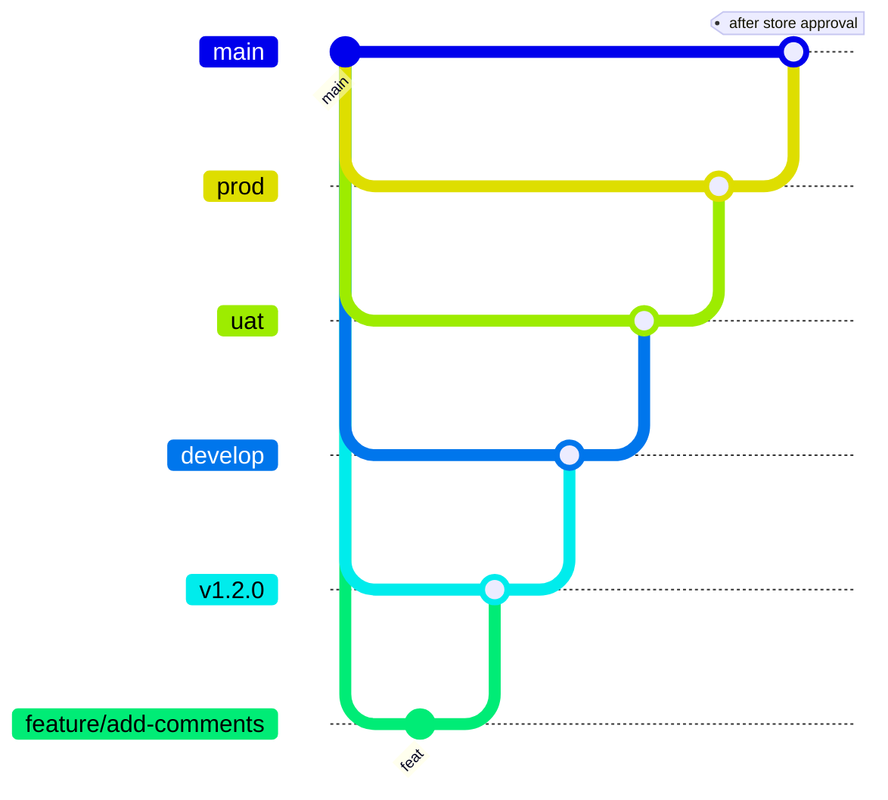
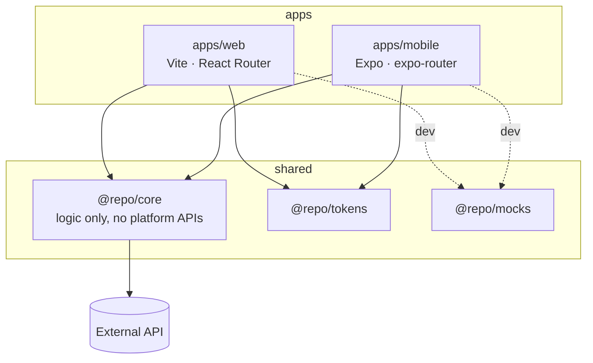

# Repo Starter — React + React Native monorepo

A production-shaped template for building a web app and a mobile app that share
their logic, designed so that **an AI agent can be the primary author** without the
repo drifting.

That goal drives every decision here: the repo is small enough to hold in one
context window, every convention is backed by a check that blocks bad output
rather than a document that asks nicely, and one command scaffolds a complete
feature so agents copy a working pattern instead of inventing one.

```bash
make setup      # checks tools, installs, generates the token CSS
make web        # http://localhost:5173 — works with NO backend
```

Sign in with `anisha@example.com` / `password123`.

> **Agents: read [AGENTS.md](AGENTS.md) first.** Several libraries here are pinned
> away from their npm `latest` for non-obvious reasons, and writing from memory
> will produce code that does not build.

---

## 1. What this is

Two apps, four shared packages, one mock backend. A clone gives you a working
authenticated CRUD app on web and mobile in about a minute, with no server to run.

| Package           | What it is                                                                                |
| ----------------- | ----------------------------------------------------------------------------------------- |
| `apps/web`        | Vite 8 + React Router 8 SPA, Tailwind 3, shadcn/ui                                        |
| `apps/mobile`     | Expo SDK 57 + expo-router, NativeWind 4                                                   |
| `packages/core`   | **All shared logic** — api client, zod schemas, TanStack Query hooks, session store, i18n |
| `packages/tokens` | Design tokens: one source for colour and radius, feeding both platforms                   |
| `packages/mocks`  | MSW handlers, fixtures, and a standalone mock API server                                  |
| `packages/config` | ESLint, TypeScript and Prettier config                                                    |

**UI components are deliberately not shared.** Logic is. See
[docs/architecture/overview.md](docs/architecture/overview.md) for why — the short
version is that NativeWind on `react-native-web` is unsupported territory, and
sharing hooks captures most of the value with none of that risk.

## 2. Tech stack

Versions live in exactly one place: the catalog in
[`pnpm-workspace.yaml`](pnpm-workspace.yaml). Package manifests say `catalog:`,
never a number.

| Concern  | Choice                                       | Notable pin                                       |
| -------- | -------------------------------------------- | ------------------------------------------------- |
| Monorepo | pnpm 11 workspaces + Turborepo 2.10          | `nodeLinker: hoisted` (required by NativeWind)    |
| Language | TypeScript **6.0.3 exact**                   | TS 7 has no compiler API — see docs/versions.md   |
| Web      | Vite 8 (Rolldown), React Router 8            | `react-router-dom` does not exist at v8           |
| Mobile   | Expo SDK 57, RN 0.86.2, expo-router          | Dev build required; Expo Go is not on SDK 57      |
| Styling  | Tailwind **3.4.19** both sides               | NativeWind 4 cannot use Tailwind 4                |
| Data     | TanStack Query v5 + Zustand + zod 4 + axios  | `ApiError` is registered as Query's default error |
| Testing  | Vitest 4 (web/core), jest-expo + Jest **29** | jest-expo@57 needs Jest 29, not 30                |
| Lint     | ESLint 10 flat config, typescript-eslint 8   | `eslint-plugin-import-x`, not `-import`           |

Floors: **Node ≥ 22.22.0**, pnpm ≥ 11.18.0, iOS 16.4+, Xcode 26.4+.

## 3. Prerequisites and quick start

Node 22.22+ (`nvm use` reads `.nvmrc`) and Corepack, which ships with Node —
pnpm's version comes from the `packageManager` field, so you do not install it
yourself. For mobile you also need Xcode 26.4+ or Android Studio.

```bash
git clone <this repo> && cd <this repo>
make setup

make web        # web app, mocks on, no backend needed
make mock       # mock API on :4000 (required by the mobile app)
make mobile     # Expo dev server
make check      # the exact gate CI runs
```

## 4. Environment variables

Copy `.env.example` to `.env` — `make setup` does it for you. Every variable is
documented in [docs/env-vars.md](docs/env-vars.md), and web variables are also
typed in `apps/web/src/vite-env.d.ts` (without that, a typo is `undefined` at
runtime with no error).

Nothing prefixed `VITE_` or `EXPO_PUBLIC_` is secret — those are inlined into a
shippable bundle.

## 5. Data layer and backend services

**This repository contains no database and no backend.** Persistence and business
authority belong to a separate API service; this repo is its two clients.

Locally, every response comes from the MSW handlers in `packages/mocks`, so there
is nothing to install or migrate:

- **web** — `msw/browser` intercepts in the page (`VITE_ENABLE_MOCKS=true`)
- **mobile** — `pnpm mock` runs the same handlers behind Express on `:4000`, and
  `apps/mobile/lib/api-url.ts` finds your machine's LAN address automatically so
  it works on a physical device

To point at a real API, set `VITE_ENABLE_MOCKS=false` and `VITE_API_URL`. The
expected contract is in [docs/api/README.md](docs/api/README.md).

## 6. Third-party services

| Service        | Used for                | Required?                                   |
| -------------- | ----------------------- | ------------------------------------------- |
| Sentry         | Errors and log shipping | No — unset the DSN and it never initialises |
| Vercel         | Web hosting             | No — `apps/web/Dockerfile` self-hosts       |
| Expo / EAS     | Mobile builds and OTA   | Yes, for real builds                        |
| GitHub Actions | CI/CD                   | Yes                                         |

## 7. Project structure

```
apps/web/src/
  features/<area>/       pages and their components
  components/ui/         vendored shadcn primitives (we own them)
  router.tsx             all routes; NO route actions
apps/mobile/
  app/                   routes ONLY — file path is the URL, default export required
  components/            everything that is not a route
  lib/                   platform adapters (storage, api-url, env)
packages/core/src/
  runtime.ts             the entire platform surface: apiUrl + storage
  api/                   axios client, ApiError, pagination
  features/<name>/       schemas · api · keys · hooks   ← the unit of work
```

The import rules that go with it are enforced by ESLint, not by convention. See
[docs/architecture/monorepo-graph.md](docs/architecture/monorepo-graph.md).

## 8. Branch strategy



Feature branches are cut from a **version** branch, not from `develop`. `main`
tracks what is live in the app stores and is merged only after Apple/Google
approval. Full rules:
[docs/outcode-git-branching-strategy.md](docs/outcode-git-branching-strategy.md).

## 9. Commits and pull requests

Conventional Commits, enforced by commitlint. `pre-commit` runs lint-staged and
blocks commits to protected branches; `pre-push` runs the full gate.

PRs use [the template](.github/pull_request_template.md) and need the `CI OK`
check plus review (2 approvals on `main`/`prod`, 1 on `uat`/`develop`). Details in
[CONTRIBUTING.md](CONTRIBUTING.md).

## 10. Architecture



Diagrams and the data-flow sequence: [docs/architecture/](docs/architecture/).

## 11. Testing

```bash
pnpm test              # Vitest: @repo/core, @repo/tokens, apps/web
pnpm test:coverage     # with thresholds — this is what CI gates on
pnpm test:mobile       # jest-expo
pnpm test:e2e          # Playwright, against the production build with mocks
```

125 unit tests, 4 mobile tests, 5 E2E specs. The E2E suite is the only check that
runs the real bundle in a real browser — on its first run it found two bugs every
unit test had missed.

Coverage thresholds live in `vitest.config.ts`: a global floor plus a higher bar
for `@repo/core`, where the real logic is. Policy and the reasoning behind the
split: [docs/testing.md](docs/testing.md).

## 12. CI/CD

| Workflow             | Trigger                        | Does                                                             |
| -------------------- | ------------------------------ | ---------------------------------------------------------------- |
| `quality.yml`        | PR to **any** protected branch | lint · types · format · tests+coverage · web build · Expo checks |
| `deploy-web.yml`     | push to `uat`/`prod`           | Vercel deploy, Sentry release + sourcemaps                       |
| `release-mobile.yml` | manual / push to `prod`        | EAS build and submit                                             |
| `release.yml`        | push to `prod`                 | tag + GitHub release from Conventional Commits                   |
| `merge-prod-to-main` | manual, environment-gated      | post-store-approval merge                                        |
| `nightly.yml`        | cron                           | Android assemble, Lighthouse, doc-link check                     |
| `codeql.yml`         | PR + weekly                    | static analysis                                                  |

`CI OK` is the single required check — it aggregates every job. Details:
[docs/delivery.md](docs/delivery.md).

## 13. Deployment

Web goes to Vercel (`apps/web/vercel.json` carries CSP and HSTS), or self-host
with `apps/web/Dockerfile` behind the bundled nginx config. Mobile goes through
EAS with three profiles. Step by step:
[docs/delivery.md](docs/delivery.md).

## 14. Troubleshooting and FAQ

[docs/troubleshooting.md](docs/troubleshooting.md) — Metro cache, pnpm hoisting,
"styles are not applying", stale TypeScript server, `expo-doctor` failures.

## 15. Known issues

[docs/known-issues.md](docs/known-issues.md) — the upstream bugs and version traps
this repo works around, each with the reason it is pinned where it is. Read it
before upgrading anything.

---

## Scripts reference

| Command              | Does                                                    |
| -------------------- | ------------------------------------------------------- |
| `pnpm dev:web`       | Vite dev server                                         |
| `pnpm dev:mobile`    | Expo dev server                                         |
| `pnpm mock`          | Mock API on `:4000`                                     |
| `pnpm gen feature`   | Scaffold a full vertical slice                          |
| `pnpm tokens:sync`   | Regenerate `global.css` from `tokens.ts`                |
| `pnpm quality:check` | The full gate                                           |
| `pnpm doctor`        | Duplicate deps + `expo-doctor` + `expo install --check` |

## Contributing · Security · License

[CONTRIBUTING.md](CONTRIBUTING.md) · [SECURITY.md](SECURITY.md) ·
[LICENSE](LICENSE) (proprietary) · [CHANGELOG.md](CHANGELOG.md)
