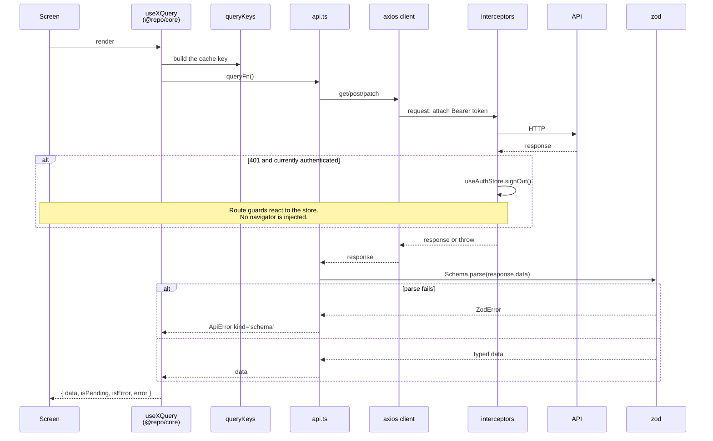

# Data flow

The same on both platforms. Read this before touching the API layer.

## The rules this encodes

**Screens never call `api.ts`, and never call axios.** Screens use hooks; hooks
call api functions; api functions use the client. Skipping a layer is how caching
and error normalisation get bypassed.

**Nothing leaves the api layer un-parsed**, and nothing leaves it as a raw axios
error. Everything a hook can reject with is an `ApiError`.

**A 401 is handled once**, in the interceptor, by clearing the session. The guards
on both platforms watch that store, which is why the interceptor needs no knowledge
of routing.

## Mutations

Same path, plus cache maintenance in the hook: seed the detail cache, invalidate
the lists, and for updates apply-then-rollback. See
[patterns.md](../patterns.md) §5.

Web has **no route `action`s** on purpose — mutations go through `useMutation` so
the logic lives in `@repo/core` and is identical on mobile.
