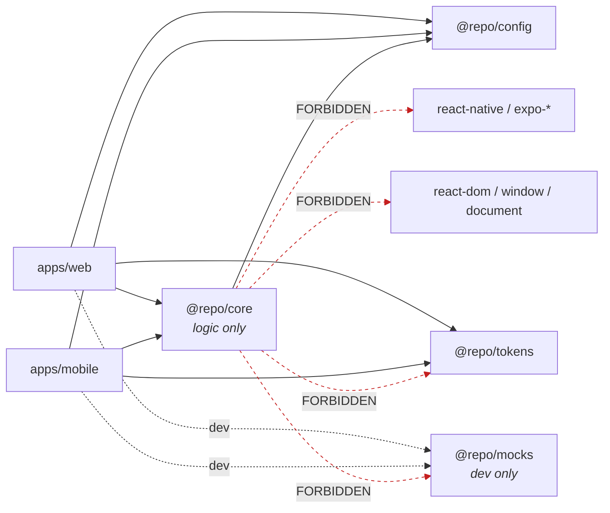

# Allowed dependencies

Red dashed edges are **forbidden and lint-enforced**.

This diagram must stay byte-consistent with the `no-restricted-imports` config in
[`packages/config/eslint/logic-only.js`](../../packages/config/eslint/logic-only.js).
If they disagree, people trust the diagram over the linter and lose.

## Why `@repo/core` may not import `@repo/tokens`

Tokens are presentation. If core could read them, business logic would start
returning colours ("this status is red"), and the two apps would lose the ability
to present the same state differently. Core returns _state_; apps decide how it
looks.

## Why `@repo/mocks` imports nothing from `@repo/core`

It is a standalone fake backend, so there is no type-level coupling and no package
cycle. The contract is verified at runtime instead, by
`packages/core/src/__tests__/mock-contract.test.ts`, which parses the mock's actual
responses against core's zod schemas. That is stronger than a shared type: it
catches a handler and a schema drifting apart, which a type import would not.

## Why the linter is the enforcement

`nodeLinker: hoisted` means every package can _physically_ resolve every other
package's dependencies — `@repo/core` can `import 'react-native'` and it will
resolve. Only ESLint stops it. That is the trade for NativeWind working under pnpm,
and it is why `import-x/no-extraneous-dependencies` and the boundary rules are
errors rather than warnings.

If the linter blocks an import, the code is in the wrong package. Moving the code is
the fix; `eslint-disable` is not.
