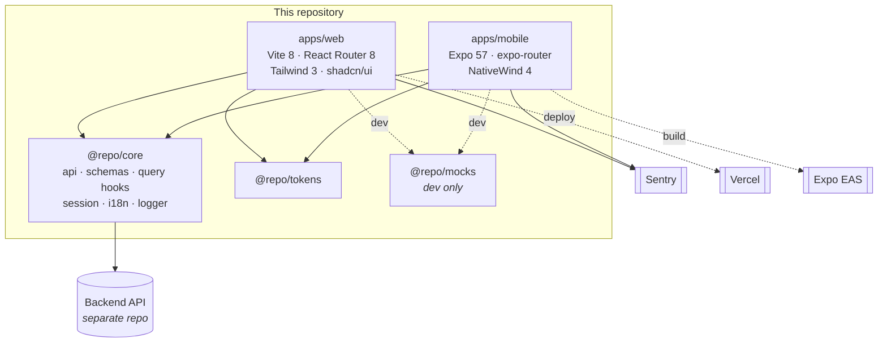

# Architecture overview

## System context



There is no database and no server here. This repo is two clients of an API that
lives elsewhere.

## The one decision everything follows from

**Share logic. Do not share UI.**

The tempting version of this repo has a `packages/ui` whose components render on
both platforms via NativeWind and `react-native-web`. We do not do that, for a
specific reason rather than a stylistic one:

- NativeWind on Vite works only through `react-native-web`'s undocumented `$$css`
  escape hatch. NativeWind closed "not working on vite" as `wontfix`, runs no Vite
  in CI, and has already shipped a regression where classes survived `vite dev` and
  were tree-shaken out of `vite build`.
- The least-tested part of that path is exactly the part apps need most: portals
  and measured-position overlays — dialogs, selects, popovers.
- In a repo where an agent writes most of the code, a failure mode the agent cannot
  diagnose is much more expensive than duplicated markup.

So `@repo/core` holds everything that _behaves_ — the API client, zod schemas,
query hooks and keys, the session store — and each app owns how it _looks_. Web gets
real shadcn/ui; mobile gets NativeWind primitives. NativeWind runs only on Metro,
its supported path, and `react-native-web` is not in the repo at all.

### What keeps the two apps consistent, then

Four things, none of which is a shared component:

1. **Shared hooks.** Both apps call the same `usePostsQuery`. They cannot disagree
   about caching, pagination, retries or error shapes.
2. **Shared zod schemas.** `createPostInputSchema` drives both forms, so validation
   rules and messages cannot drift.
3. **Shared tokens.** One `tokens.ts` generates both apps' CSS variables, and a
   drift test fails if either app declares a colour locally.
4. **The generator.** `pnpm gen feature` emits both platforms' screens from one
   invocation, written against the same hook signature, rendering the same states in
   the same order, with `Counterpart:` headers cross-referencing each other. This is
   the shared-UI layer, materialised at generation time instead of imported at
   runtime.

## The platform boundary

`packages/core/src/runtime.ts` — two members:

```ts
interface CoreRuntime {
  apiUrl: string;
  storage: CoreStorage; // async on BOTH platforms
}
```

`storage` is async on web too, even though `localStorage` is synchronous, because
`expo-secure-store` is async and one code path in core beats two.

Resist a third member. Each one is something an agent must learn before writing a
query hook, and something that can be wired up correctly in one app and wrongly in
the other. Notably absent: no `onUnauthorized`, because the 401 interceptor clears
the session store and both platforms' guards already watch it.

## Trade-offs we accepted

| Accepted                                            | Because                                                                                     |
| --------------------------------------------------- | ------------------------------------------------------------------------------------------- |
| Markup written twice                                | The alternative is an unsupported bundler path in the riskiest layer                        |
| `nodeLinker: hoisted`, so phantom deps are possible | NativeWind has two unfixed pnpm bugs; lint covers the phantom-dep risk                      |
| Tailwind 3, not 4                                   | NativeWind 4 requires it, and a mixed-major workspace is worse                              |
| `cn()` duplicated in both apps                      | The RNR CLI expects `~/lib/utils` and cannot be aliased; a test asserts they stay identical |
| Web signs out on hard reload                        | Memory-only tokens; the real fix needs a backend refresh cookie                             |
